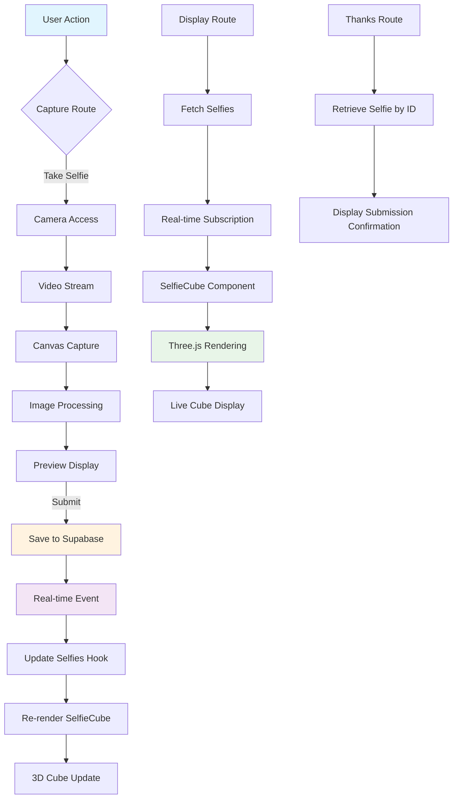

# Cube of Joy - Project Architecture

## Overview
Cube of Joy is a photo booth application that allows users to take selfies, which are then displayed in a rotating 3D cube. The application uses React with TanStack Start, Three.js for 3D rendering, and Supabase for real-time data storage.

## System Components

### Frontend (React/TanStack Start)
- **Routes**: 
  - `/` (index.tsx) - Landing page with Titan branding and navigation
  - `/capture` (capture.tsx) - Camera interface for taking selfies
  - `/display` (display.tsx) - Live 3D cube view with GIF export
  - `/thanks` (thanks.tsx) - Thank you page after submitting selfie

### Core Components
- **SelfieCube.tsx** - Main 3D cube component using React Three Fiber
  - SelfieTile - Individual cube faces with selfie textures
  - CubeGroup - Manages the collection of cubes forming the larger structure
  - Uses Three.js for rendering and @react-three/drei for controls

### State Management & Hooks
- **use-selfies.ts** - Custom hook for fetching and subscribing to selfie updates
- **use-mobile.tsx** - Mobile detection hook

### Data Layer
- **selfie-store.ts** - Supabase integration for selfie storage
  - listSelfies() - Fetch all selfies from Supabase
  - addSelfie() - Upload new selfie to Supabase
  - getSelfie() - Retrieve selfie (with caching)
  - Real-time subscription to selfies
  - deleteAllSelfies() - Clear all selfies (admin useSelfie
  - Camera access and mirroring
  - Frame overlay
 OTH
  _01.png)
  - Selfie saving with local copy option
  - Real-time upload to Supabase
 
 2. 3D Cube Display
  - Dynamic cube sizing based on number of selfies
  - Automatic rotation on X and Y axes
  - Interactive controls (zoom, pan, rotate)
  - Placeholder textures for empty positions
  - Object-cover image mapping for proper display
 
 3. Real-time Updates
  - Server-Sent Events (SSE) for live selfie updates
  - Automatic cube updates when new selfies are added
  - Session storage caching for immediate selfie retrieval
 
 4. GIF Export
  - Canvas capture of the 3D cube
  - GIF generation with configurable frame rate
  - Download functionality for sharing

## Data Flow



## Technical Stack

### Frontend
- **Framework**: React 19 with TanStack Start
- **Routing**: TanStack React Router
- **State**: React Hooks (useState, useEffect)
- **Styling**: Tailwind CSS
- **3D Graphics**: 
  - @react-three/fiber
  - @react-three/drei
  - Three.js
- **Real-time**: Supabase Realtime (SSE)
- **Forms**: React Hook Form with Zod validation
- **Notifications**: Sonner

### Backend
- **Database**: Supabase Postgres
- **Storage**: Supabase for image data (stored as base64)
- **API**: REST endpoints for selfie CRUD operations
- **Realtime**: Server-Sent Events for live updates

### Build & Dev
- **Bundler**: Vite
- **Language**: TypeScript
- **Linting**: ESLint with Prettier
- **Package Manager**: Bun/NPM

## Key Features Implemented

1. **Camera Integration**
   - User media access with proper error handling
   - Video stream manipulation and canvas capture
   - Mirrored preview for natural selfie experience

2. **Image Processing**
   - Frame overlay (PHOTBOOTH_01.png)
   - Object-cover scaling for proper framing
   - JPEG compression for efficient storage

3. **3D Visualization**
   - Dynamic cube generation based on selfie count
   - Smooth rotation on multiple axes
   - Interactive controls with bounds
   - Efficient texture loading and caching

4. **Real-time Collaboration**
   - Live updates when users submit selfies
   - Session storage caching for performance
   - Automatic cleanup on disconnect

5. **Export & Sharing**
   - GIF creation from 3D cube canvas
   - Configurable frame rate and quality
   - Local selfie saving option

## Supabase Schema (inferred)

```sql
Table: selfies
- id: UUID (Primary Key)
- image_data: TEXT (base64 encoded JPEG)
- created_at: TIMESTAMP WITH TIME ZONE
```

## Environment Variables
- Supabase URL and anon key (configured in .env)

## Responsive Design
- Mobile-friendly layouts
- Adaptive font sizing with clamp()
- Touch-friendly controls
- Optimized for various screen sizes

## Performance Considerations
- Texture caching and reuse
- Efficient GIF encoding with web workers
- Lazy loading where applicable
- Minimizing re-renders with React.memo (where implemented)